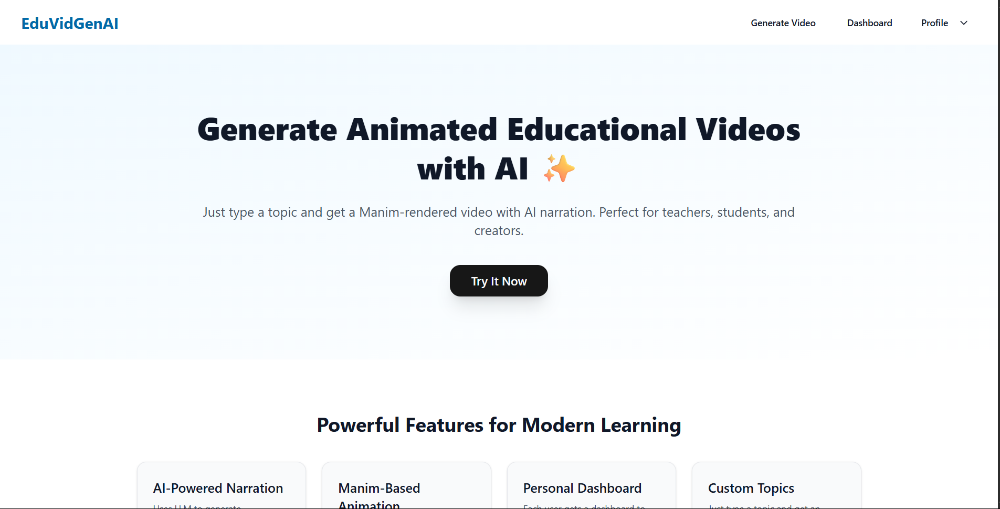
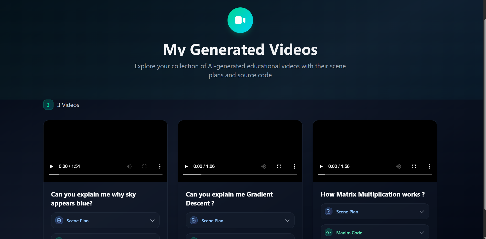
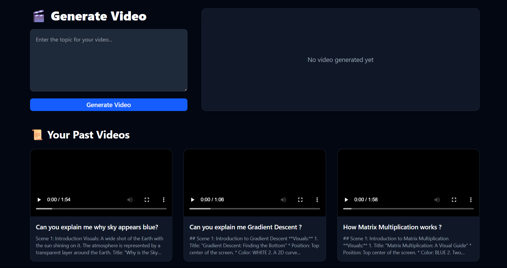
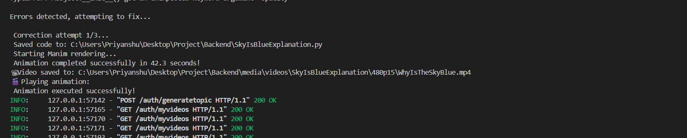

# EduVidGenAi

EduVidGenAi is an AI-powered platform for generating animated educational videos. Simply enter a topic and receive a visually engaging, narrated video, complete with scene plans and source code! The system leverages LLMs for content planning, Python's Manim for animation, and Supabase Storage for scalable video hosting. Perfect for teachers, students, and content creators.

---

## ✨ Features

- **AI-Powered Narration:** Uses large language models to generate educational explanations and voiceovers.
- **Manim-Based Animation:** Renders videos using Python’s Manim library in 2D/3D.
- **Personal Dashboard:** Each user gets a dashboard to store and rewatch generated videos.
- **Custom Topics:** Just type a topic and get a detailed, visual explanation video.
- **Easy Video Access:** Videos are securely stored and streamed via Supabase.

---

## 🏗️ Architecture Overview

### Frontend

- **Framework:** Next.js (React)
- **Key Pages:**
  - `/generate`: Enter a topic, trigger video generation, and view the generated video.
  - `/dashboard`: Browse and play all your previously generated videos.
- **Video Player:** HTML `<video>` element with dynamic video URLs.

### Backend

- **Framework:** FastAPI (Python)
- **Endpoints:**
  - `POST /auth/generatetopic`: Accepts a topic, generates video, uploads it, returns video URL and metadata.
  - `GET /auth/myvideos`: Lists all videos generated by the user.
- **Video Generation Flow:**
  1. Generate scene plan and Manim code using LLMs.
  2. Execute the Manim code to render an animation.
  3. Upload the resulting `.mp4` to Supabase Storage.
  4. Store metadata (title, scene plan, code, URL) in DB.
  5. Return video URL to frontend.

### Video Storage

- **Supabase Storage:** Videos are stored in per-user folders and served via signed URLs.

---

## 🚀 Quick Start

### 1. Clone the repository

```bash
git clone https://github.com/priyanshu2393/EduVidGenAi.git
cd EduVidGenAi
```

### 2. Set up the Backend

- Install dependencies:
  ```bash
  cd Backend
  pip install -r requirements.txt
  ```
- Configure environment variables for Supabase and database access.
- Run the FastAPI server:
  ```bash
  uvicorn auth.main:app --reload
  ```

### 3. Set up the Frontend

- Install dependencies:
  ```bash
  cd frontend
  npm install
  ```
- Run the Next.js app:
  ```bash
  npm run dev
  ```

### 4. Access the App

- Open [http://localhost:3000](http://localhost:3000) in your browser.

---

## 🧩 File Structure

```
Backend/
  auth/
    routes.py      # API endpoints for video generation, user, etc.
    schemas.py     # Pydantic models
  Model/
    langchain.py   # Manim code generation & execution logic

frontend/
  src/
    app/
      generate/    # Video generation page
      dashboard/   # User dashboard
    components/    # UI components
```

---
## 📸 Screenshots

Below are some screenshots to illustrate the main features and UI of EduVidGenAi:

### 1. Home Page


### 2. Dashboard Page


### 3. Generate Video Page


### 4. Error Correction Loop
.

## 🎬 Working Demo Video

- [Sample Video ](https://drive.google.com/file/d/1Gak8u-kScXTM6XxdXa98f5JmskdfpFP4/view?usp=sharing)

  
## ⚙️ Configuration

- **Supabase:** Set your Supabase credentials in the backend config/environment.

## 🙏 Acknowledgments

- [Manim Community](https://www.manim.community/)
- [Gemini](https://gemini.google.com/)
- [Supabase](https://supabase.com/)
